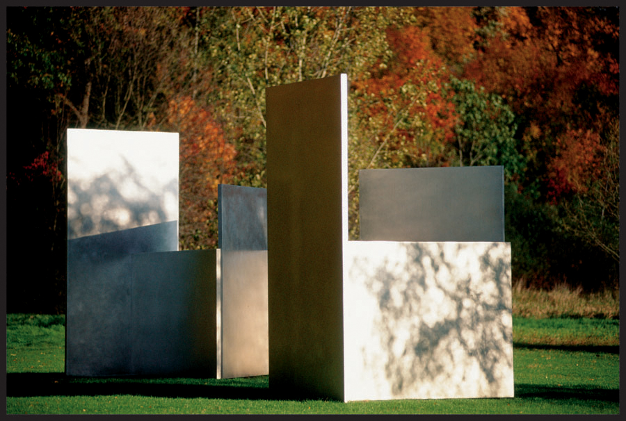

# ywan0254_9103_tut3

# Quiz 8: Design Research

## Part 1: Imaging Technique Inspiration

### Chosen Technique: Impressionist Colour and Dappled Light

**Image source:** Claude Monet, *The Parc Monceau*, 1878. Image from [Wikimedia Commons](https://commons.wikimedia.org/wiki/File:Claude_Monet,_The_Parc_Monceau,_1878.jpg). Artwork collection page: [The Metropolitan Museum of Art](https://www.metmuseum.org/art/collection/search/437108).

**Image source:** Edward Tufte, *Dappled light*, April 10, 2007. Image from [Edward Tufte’s notebook](https://www.edwardtufte.com/notebook/dappled-light/0002pS-4115.jpg).

My imaging inspiration combines Impressionist colour and dappled light. In Claude Monet’s *The Parc Monceau* (1878), light and shade are broken into leaf-like patterns rather than flat areas. I am also inspired by Edward Tufte’s *Dappled light* study, where sunlight filtered through leaves forms shifting spots across stainless-steel sculpture. I want to borrow this effect to create a wall surface where white light contains blues, greens, yellows, and pinks from its surroundings. This would make my project feel atmospheric, natural, and responsive instead of static.

## Part 2: Coding Technique Exploration

### Coding Technique: Perlin Noise and Alpha Masks

**Image source:** p5.js *Noise* example thumbnail from the official [p5.js example repository](https://github.com/processing/p5.js-example/tree/main/examples/07_Repetition/04_Noise).

A useful coding technique is combining Perlin noise with alpha masks in p5.js. The `noise()` function can generate smooth, organic changes over time, which could control the movement of virtual leaves or the position of projected light patches. Alpha masks can define which areas are transparent or blocked, similar to light passing through gaps in foliage. With mouse interaction, the noise offset or mask position could change, making the dappled shadows sway as if wind is moving through the tree canopy.

### Example Implementation Links

- [p5.js Noise example](https://p5js.org/examples/repetition-noise/)
- [Noise example code on GitHub](https://github.com/processing/p5.js-example/blob/main/examples/07_Repetition/04_Noise/code.js)
- [p5.js Alpha Mask example](https://p5js.org/examples/imported-media-alpha-mask/)
- [Alpha Mask example code on GitHub](https://github.com/processing/p5.js-example/tree/main/examples/03_Imported_Media/02_Alpha_Mask)
